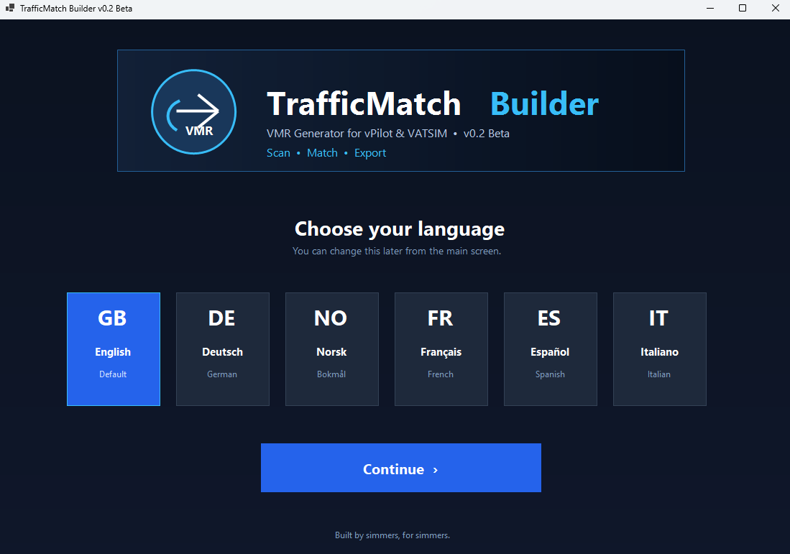
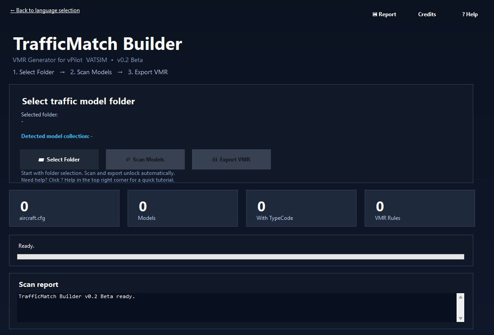
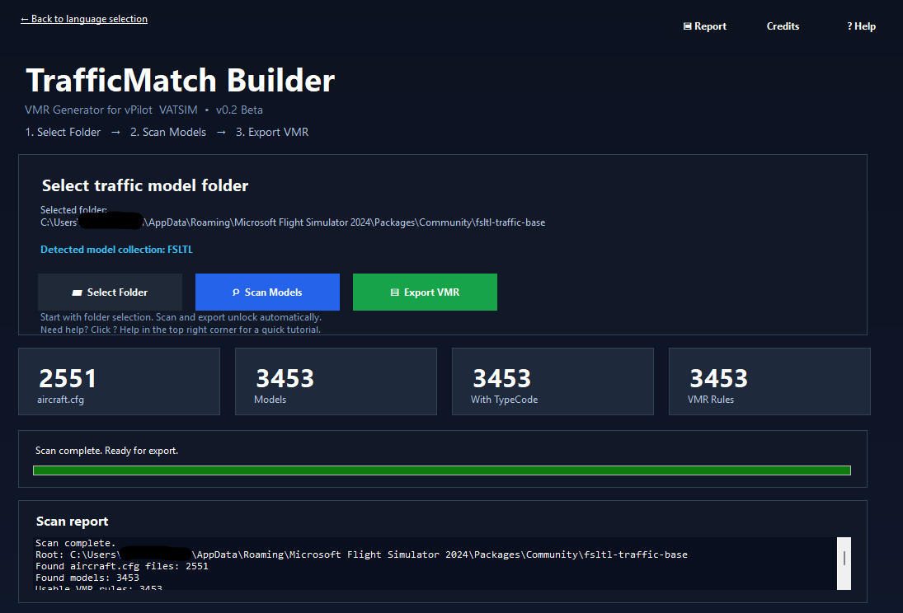

# TrafficMatch Builder

**Automatic Model Matching Generator for Microsoft Flight Simulator**

TrafficMatch Builder is a lightweight utility that automatically scans installed traffic model libraries and generates ready-to-use VMR (Virtual Model Rule) files for vPilot and VATSIM.

Instead of manually editing XML files and creating model matching rules by hand, TrafficMatch Builder analyzes your installed traffic models and generates matching configurations within seconds.

---

## Features

* Automatic traffic model scanning
* Automatic VMR generation
* Support for large traffic model libraries
* Multi-language user interface
* Built-in Help and Tutorial system
* Detailed scan reports and statistics
* Modern dark mode interface
* Offline operation
* Portable application
* No installation required
* No administrator privileges required

---

## Screenshots

### Language Selection

Choose your preferred language when launching the application.

---

### Main Window

Simple three-step workflow:

**Select Folder → Scan Models → Export VMR**

The application guides users through the complete process with a clean and beginner-friendly interface.

---

### Scan Complete

TrafficMatch Builder automatically detects installed aircraft models and generates ready-to-use VMR rules for export.

---

## What is a VMR File?

A VMR (Virtual Model Rule) file tells vPilot which aircraft model should be displayed when another pilot connects to the VATSIM network.

Without proper model matching you may encounter:

* Incorrect aircraft types
* Missing liveries
* Generic substitute aircraft
* Reduced realism during online flying

TrafficMatch Builder helps automate the creation of these matching rules based on the traffic models already installed on your system.

---

## How It Works

TrafficMatch Builder scans the selected traffic model folder and searches for aircraft configuration files.

The application automatically reads information such as:

* Aircraft model names
* Aircraft type codes
* Airline codes
* Available model variations

Using this information, TrafficMatch Builder generates VMR rules and exports them into a ready-to-use VMR file.

The application does not install aircraft, download content or modify simulator files.

---

## Quick Start

1. Launch TrafficMatch Builder
2. Select your language
3. Choose your traffic model folder
4. Click **Scan Models**
5. Review the detected models
6. Click **Export VMR**
7. Save the generated VMR file
8. Import the generated file into vPilot

---

## Version 0.2 Beta

### Highlights

* Complete rewrite in C# / .NET 8
* New standalone executable
* Improved scanning engine
* Improved VMR generation
* Multi-language support
* Built-in Help system
* Enhanced scan reports
* Improved user interface
* Reduced antivirus false positives
* Numerous internal optimizations

---

## Portable Application

TrafficMatch Builder is fully portable.

* No installation required
* No setup wizard
* No administrator privileges required

Simply download, extract and launch the application.

---

## Security & Privacy

TrafficMatch Builder operates entirely offline.

The application:

* Does not collect personal information
* Does not collect telemetry
* Does not upload files
* Does not download files
* Does not modify simulator files
* Does not modify traffic model files
* Does not connect to external servers
* Does not connect to the VATSIM network

TrafficMatch Builder only reads aircraft configuration files selected by the user and generates VMR files based on the information found.

---

## Disclaimer

TrafficMatch Builder is designed to work with traffic packages for Microsoft Flight Simulator by indexing installed aircraft models and generating configuration files.

Users are solely responsible for ensuring that their use of third-party content complies with the respective terms of use.

The developer does not endorse or encourage any use that violates third-party conditions.

---

## FlightSim.To

https://flightsim.to/addon/109917/trafficmatch-builder-msfs-traffic-library-vmr-generator

---

## GitHub Releases

Download the latest version from the Releases section of this repository.

---

## Beta Notice

TrafficMatch Builder is currently an early beta release.

While extensive testing has been performed, minor bugs, compatibility issues or unexpected behavior may still occur.

Feedback, bug reports and feature suggestions are always welcome and help improve future versions.

---

## Legal Notice

TrafficMatch Builder is an independent community project.

This software is not affiliated with, endorsed by or sponsored by VATSIM, vPilot, Microsoft, Asobo Studio, FSLTL, AIG or any other third-party organization.

All trademarks and product names are the property of their respective owners.

---

## License

Copyright © 2026 Nils

TrafficMatch Builder is provided free of charge.

Redistribution of the original, unmodified release package is permitted.

Modification, repackaging, redistribution under a different name or claiming the project as your own work is not permitted without prior permission from the author.

---

**Built by simmers, for simmers.**
